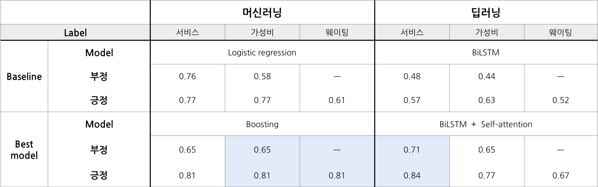

# Mango_plate_NLP

## 1. crawling

식신, 망고플레이트, 포잉 : requests, selenium

## 2. preprocessing

- labeling (맛, 서비스, 웨이팅)

## 3. model

- [machine learning](https://github.com/krisuety/Mango_plate_NLP/tree/master/model/machine_learning)
- [deep learning](https://github.com/krisuety/Mango_plate_NLP/tree/master/model/deep_learning)

## 4. predict

- 가성비, 웨이팅 best : boosting
- 서비스 best : self attention + biLSTM

(metric : F-1 score)

## 5. web (Flask, nginx, uWSGI)

[식당 조회해보기](15.164.204.219)
